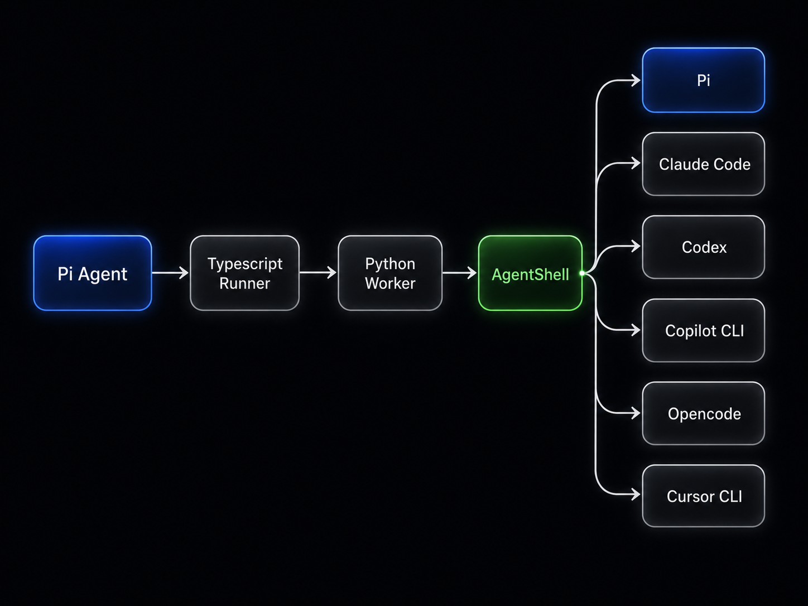

# Pi AgentShell Extension

A [Pi](https://github.com/earendil-works/pi) extension for delegating tasks to other coding
harnesses, including Pi, through [AgentShell](https://github.com/ScottRBK/agent-shell).

## Architecture



## Requirements

- Linux, macOS, or WSL2
- Pi
- [uv](https://docs.astral.sh/uv/getting-started/)
- Python 3.12 or newer, which uv can provide

## Installation

```bash
pi install git:github.com/ScottRBK/pi-agentshell-extension
```

## Getting Started

The first time Pi starts with the extension installed, it will:

- Check whether `uv` is available
- Ask for permission to run `uv sync --locked`, which installs AgentShell
- Register the tool immediately after setup

## Usage

Once in a Pi session, you can ask it to delegate a task to another coding agent.

For example:

> Ask Codex to review this project and identify any bugs.

See AgentShell's
[list of supported agent types](https://github.com/ScottRBK/agent-shell#features).

The tool accepts the following parameters:

| Parameter | Required | Description |
| --- | :---: | --- |
| `agent_type` | Yes | AgentShell agent type, such as `claude_code` or `codex`. |
| `prompt` | Yes | Task given to the subagent. |
| `cwd` | No | Working directory; defaults to Pi's current working directory. |
| `model` | No | Model identifier passed to AgentShell. |
| `effort` | No | Reasoning effort; supported values depend on the agent. |
| `auto_approve` | No | Allows automatic tool approval; defaults to `false`. |
| `allowed_tools` | No | Tool allow-list; support varies by agent. |
| `disallowed_tools` | No | Tool deny-list; support varies by agent. |

AgentShell warnings are included in the tool result when an agent cannot enforce a control.

## Output Limits

The extension stops a subagent if any of these limits are exceeded:

| Setting | Default | What it limits |
| --- | ---: | --- |
| `maxOutputBytes` | 64 KiB | Text returned to Pi. |
| `maxProtocolBytes` | 2 MiB | Total data sent by the AgentShell worker. |
| `maxMessageBytes` | 256 KiB | One message sent by the AgentShell worker. |
| `maxStderrBytes` | 256 KiB | Diagnostic output from the AgentShell worker. |

When text output exceeds its limit, the failed tool result includes a UTF-8-safe truncated prefix.

To override the defaults, create `~/.pi/agent/extensions/agentshell.json`:

```json
{
  "maxOutputBytes": 131072,
  "maxProtocolBytes": 4194304,
  "maxMessageBytes": 524288,
  "maxStderrBytes": 524288
}
```

Overrides may be partial. Values are positive whole numbers in bytes. `maxOutputBytes` and
`maxMessageBytes` cannot exceed `maxProtocolBytes`. Run `/reload` after changing the file.

## Safety and Limitations

- Child processes run with the user's permissions
- Approval bypass is disabled by default
- Child Pi sessions do not receive the subagent tool, preventing recursive delegation

## Removal

```bash
pi remove git:github.com/ScottRBK/pi-agentshell-extension
```

## License

[MIT](LICENSE)
